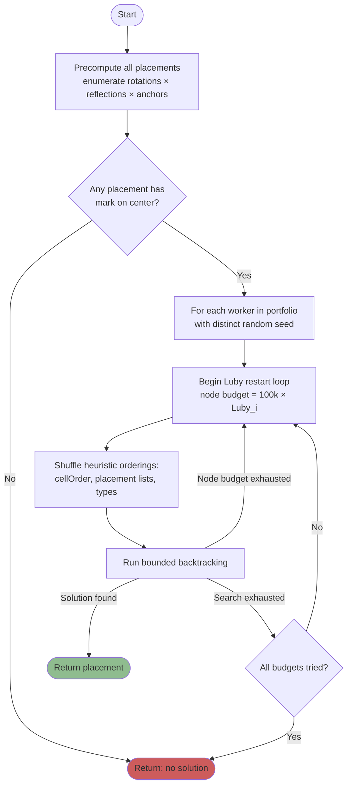
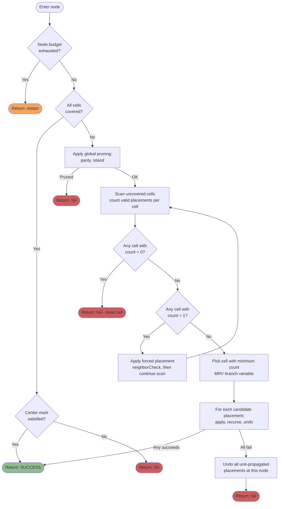

# ExactCover solver

The ExactCover solver handles the restricted variant of the Union
placement problem where the set of cells to be covered is specified
exactly. It is a pure exact-cover instance with additional constraints
(connectivity, center mark).

## Problem statement

Given:
- A set of target cells **T** on the grid.
- A multiset of pieces, each with a fixed polyomino shape (up to rotations
  and reflections) and a designated *mark cell*.
- The "center" region: a fixed set of 4 cells on the board.

Find a placement of all pieces such that:
1. Each placed piece occupies cells entirely within **T**.
2. No two pieces overlap.
3. The set of covered cells equals **T** (exact cover).
4. All placed pieces together form a single 4-connected region.
5. At least one piece's mark cell lies within the center region.

## High-level flow



The first worker to reach `Success` wins; all others are terminated. Each
worker is independent and uses `crypto.getRandomValues` for its seed.

## Per-node decision flow

Inside `backtrack()`, each recursive call performs:



The unit propagation loop (Scan → Apply → Scan) compresses chains of
forced decisions into a single node. Only when no `count = 1` cell
remains does the algorithm branch.

## Approach

Randomized backtracking with aggressive pruning, restart portfolio, and
unit propagation. The key design choices:

- **Bitset state**: the board state is a `Uint32Array` of fixed length
  (capacity 224 cells, more than enough for the 201-cell board).
- **Precomputed placements**: every valid (shape, rotation, reflection,
  anchor) tuple is enumerated once at setup and stored as a bitset.
  Placement legality checks reduce to bitwise AND.
- **Dynamic MRV branching**: at each node, the cell with the fewest valid
  placements is chosen as the branch variable.

The unit propagation phase is crucial. It compresses straight-line chains
of forced decisions into a single node, eliminating repeated evaluation of
the feasibility checks and reducing the effective depth of the search
tree.

## Pruning

Three checks reject infeasible subtrees early:

### Parity check

The board is 2-colored like a checkerboard. For any remaining set of pieces
to cover the remaining uncovered cells, the number of black cells they
contribute must fall within a feasible range determined by the pieces'
individual minimum and maximum black-cell counts (across all their
rotations).

This is computed as a range intersection:

```
needed_black ∈ [black_uncovered_min, black_uncovered_max]
pieces_can_contribute ∈ [Σ min_black(p), Σ max_black(p)]
if these ranges don't intersect: prune
```

### Island check

Uncovered cells are partitioned into connected components via BFS. Each
component's size must be expressible as a sum of remaining piece sizes (a
subset-sum check). If any component fails this, the subtree is infeasible.

A DP over piece sizes precomputes all reachable subset sums in `O(N × Σ
piece_count)` time, reused across all components.

### Neighbor dead-cell check

After placing a piece, each uncovered neighbor cell is checked: does at
least one valid placement still exist that can cover it? If any neighbor
has zero valid coverings, the current placement is rejected.

This is the problem-specific analog of SAT's conflict detection. It
catches decisions that strand cells before more expensive global checks
(parity, island) would run.

## Randomization and restarts

The algorithm is randomized in three places:

1. **Cell ordering**: the iteration order over cells in the MRV scan is
   shuffled at the start of each restart.
2. **Placement ordering**: for each cell, the order in which its
   placements are tried is shuffled.
3. **Type ordering**: when the MRV scan finds multiple cells with the same
   minimum count, the tie-break is random.

Runtime exhibits a heavy-tail distribution: the same instance can take
milliseconds or many minutes depending on the seed. Two techniques
mitigate this:

### Luby restart schedule

Instead of a fixed node budget per restart, budgets follow the Luby
sequence `1, 1, 2, 1, 1, 2, 4, 1, 1, 2, 1, 1, 2, 4, 8, ...` multiplied by
a base (currently 100,000 nodes). This schedule has a provable optimality
property for randomized algorithms with unknown runtime distributions
(Luby, Sinclair, Zuckerman 1993).

### Worker portfolio

The UI spawns multiple Web Workers, each running the solver with a
different seed. The first worker to find a solution wins. This converts
the runtime distribution from `X` to `min(X_1, ..., X_N)`, dramatically
reducing the tail.

Seeds are drawn from `crypto.getRandomValues` to avoid correlation between
consecutive solves.

## Data structures

### Placement representation

```
struct Placement {
    type_idx:       u8,            // which piece type
    bits:           [u32; WORDS],  // cells occupied (bitset)
    neighbor_bits:  [u32; WORDS],  // cells adjacent but outside
    cell_indices:   Vec<u16>,      // for iteration
    mark:           (u8, u8),      // mark cell coordinate
    mark_on_center: bool,          // precomputed
    b_count:        u8,            // black cells covered (for parity)
}
```

The `neighbor_bits` field enables O(WORDS) connectivity checking: a
placement is connected to the existing coverage iff `covered AND
neighbor_bits ≠ 0`.

### Per-cell placement index

For each cell, a list of all placements that cover it, grouped by piece
type. This is the inner loop of the MRV scan and the unit propagation
check: iterating "all placements of remaining types that cover cell c" is
a direct table lookup.

## Known limitations

- **Unsatisfiable instances**: the random-restart structure cannot prove
  unsatisfiability. An infeasible input causes the solver to run
  indefinitely.
- **Worst-case instances**: some seed × instance combinations produce
  unreasonably large search trees even with all pruning. The portfolio
  approach mitigates this but does not eliminate it. Empirically, p99
  runtime remains significantly above median.

Both limitations motivate the ML-guided branching approach documented
separately in [`../ml/features.md`](../ml/features.md).

## References

- Knuth, *Dancing Links* (2000). Background on exact cover.
- Luby, Sinclair, Zuckerman, *Optimal Speedup of Las Vegas Algorithms*
  (1993). Restart schedule.
- Gomes et al., *Heavy-tailed phenomena in satisfiability and constraint
  satisfaction problems* (2000). Motivation for restart portfolio.
